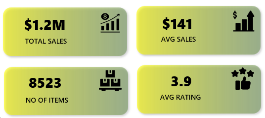
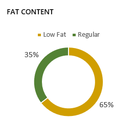
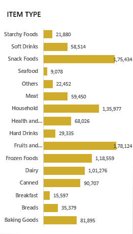
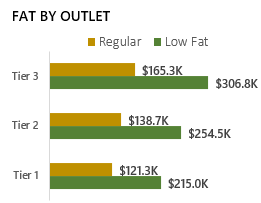
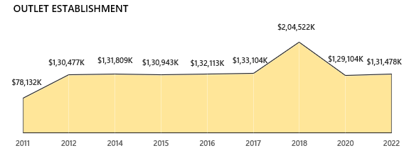
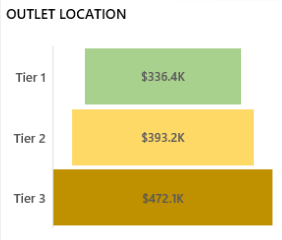
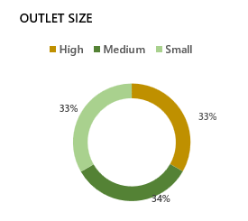
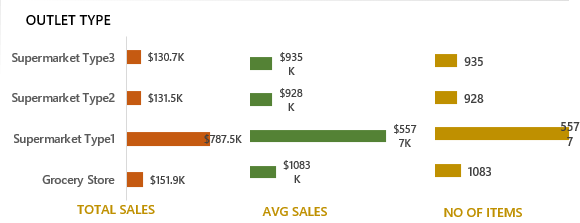
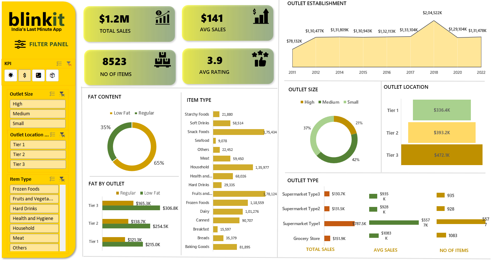

# Blinkit Sales Analysis Dashboard

## Overview
This project involves the creation of a dynamic sales dashboard using Microsoft Excel, designed to visualize and analyze Blinkit's grocery sales data across multiple business dimensions. The dashboard helps users explore sales performance, item categories, outlet characteristics, and customer ratings through interactive charts and KPIs. It transforms raw data into meaningful insights that support better business decision-making.

The dashboard includes key performance indicators (KPIs) such as Total Sales, Average Sales, Number of Items Sold, and Average Ratings. These KPIs help track overall business performance and highlight trends across product types, outlet locations, and store sizes.

---

## Sample Data Table 
Blinkit Grocery Data Table

| Sr No | Fat Content | Item Identifier | Item Type              | Outlet Year | Outlet ID | Location | Outlet Size | Outlet Type          | Visibility    | Weight | Sales     | Rating |
|-------|-------------|-----------------|-------------------------|-------------|-----------|----------|-------------|-----------------------|----------------|--------|-----------|--------|
| 1     | Regular     | FDX32            | Fruits and Vegetables  | 2012        | OUT049    | Tier 1   | Medium      | Supermarket Type1     | 0.1000135     | 15.10  | 145.4786  | 5      |
| 2     | Low Fat     | NCB42            | Health and Hygiene     | 2022        | OUT018    | Tier 3   | Medium      | Supermarket Type2     | 0.008596051   | 11.80  | 115.3492  | 5      |
| 3     | Regular     | FDR28            | Frozen Foods           | 2016        | OUT046    | Tier 1   | Small       | Supermarket Type1     | 0.025896485   | 13.85  | 165.0210  | 5      |
| 4     | Regular     | FDL50            | Canned                 | 2014        | OUT013    | Tier 3   | High        | Supermarket Type1     | 0.042277867   | 12.15  | 126.5046  | 5      |
| 5     | Low Fat     | DRI25            | Soft Drinks            | 2015        | OUT045    | Tier 2   | Small       | Supermarket Type1     | 0.033970195   | 19.60  | 55.1614   | 5      |
| 6     | Low Fat     | FDS52            | Frozen Foods           | 2020        | OUT017    | Tier 2   | Small       | Supermarket Type1     | 0.005505481   | 8.89   | 102.4016  | 5      |
| 7     | Low Fat     | NCU05            | Health and Hygiene     | 2011        | OUT010    | Tier 3   | Small       | Grocery Store         | 0.098312421   | 11.80  | 81.4618   | 5      |
| 8     | Low Fat     | NCD30            | Household              | 2015        | OUT045    | Tier 2   | Small       | Supermarket Type1     | 0.026903714   | 19.70  | 96.0726   | 5      |
| 9     | Low Fat     | FDW20            | Fruits and Vegetables  | 2014        | OUT013    | Tier 3   | High        | Supermarket Type1     | 0.024129332   | 20.75  | 124.1730  | 5      |

--- 

## KPI Table
The KPI table consolidates the most essential performance metrics for the retail analysis.These KPIs allow the dashboard to provide actionable insights by comparing important aspects of sales performance.
| KPI Name     | Symbol | Formula           |
|--------------|--------|-------------------|
| Total Sales  | 💲     | `SUM(Sales)`      |
| Avg Sales    | 💹     | `AVG(Sales)`      |
| No. of Items | 📦     | `COUNT(Sr No)`    |
| Avg Rating   | 🌟     | `AVG(Ratings)`    |

--- 
## Problem Statement Solved
The Blinkit Sales Analysis Dashboard answers several business questions, providing in-depth insights into key performance areas:

1. **KPIs** 
Metrics Covered: Total Sales, Average Sales, Number of Items, Average Ratings.

  

2. **Total Sales by Fat Content**  
Compare sales performance between Regular and Low Fat products.

  

3. **Total Sales by Item Type**  
Identify top-selling product categories.

  

4. **Fat Content by Outlet Avg Sales**  
Understand which outlet types perform best for each fat content.
 
  

5. **Total Sales by Outlet Establishment**  
Track sales trends based on outlet year or establishment.

  

6. **Number of Items by Outlet Location**  
See item distribution across different locations.
  
  

7. **Avg Rating by Outlet Size**  
Evaluate customer satisfaction by store size.
 
  

8. **All Metrics by Outlet Type**  
Consolidated view of sales, items, and ratings across outlet types.
 
  

---

## Snapshot of the Dashboard
A complete view of the Dynamic Retail Dashboard, showcasing all key metrics and visualizations in one interactive interface.
 

---
## Conclusion
The Blinkit Sales Analysis Dashboard is a powerful tool for retail decision-making, offering a comprehensive view of sales performance across products, outlets, and customer ratings. By aggregating and visualizing key metrics such as Total Sales, Average Sales, Number of Items, and Customer Ratings, the dashboard enables business analysts and managers to quickly identify trends, monitor performance, and make data-driven decisions.

Through its interactive charts and KPI summaries, stakeholders can analyze sales by fat content, item type, outlet characteristics, and location, allowing for better inventory planning, marketing strategies, and operational improvements. Overall, this dashboard enhances retail insights, improves strategic planning, and supports the optimization of Blinkit’s business operations.

